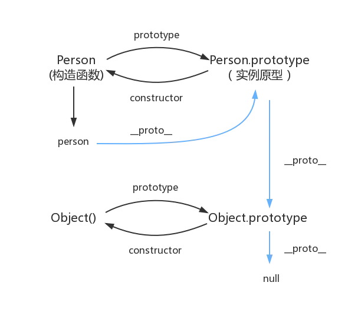

# 原型链



``` javascript

Person.prototype === person.__proto___ //true
Person.prototype.constructor === Person //true

person.constructor === Person //true

```

JavaScript的原型链是实现对象继承的核心机制，简单来说，每一个对象都有一个原型，通过 **\_\__proto___** 属性指向该对象的原型，通常是**Object.prototype**，同时该对象的原型也拥有原型，直至 **\_\__proto___** 属性指向 **null**，形成了一条完整的链式结构，就形成了原型链。

``` javascript
/**
 * 对象 o 原型链
 * {a:1,b:2} -> {b:3,c:4} -> Object.prototype -> null
 */
const o = {
    a:1,
    b:2,

    // __proto__ 可以显式设置对象 o的 [[Prototype]]
    __proto__:{
        b:3,
        c:4,
    },
}
console.log(o)
console.log(o.a)
// o 上有自有属性“b”吗？有，且其值为 2。
// 原型也有“b”属性，但其没有被访问。
// 这被称为属性遮蔽（Property Shadowing）
console.log(o.b)
console.log(o.c)
console.log(o.d); // undefined
console.log(o.__proto__.__proto__) // Object.prototype
console.log(o.__proto__.__proto__.__proto__) // null

```

**特性**
- 当读取实例的属性时，如果找不到，就会查找与对象关联的原型中的属性，如果还查不到，就去找原型的原型，一直找到最顶层为止。

- **\_\__proto___** ，绝大部分浏览器都支持这个非标准的方法访问原型，然而它并不存在于 **Person.prototype** 中，实际上，它是来自于 **Object.prototype** ，与其说是一个属性，不如说是一个 getter/setter，当使用 **obj.\_\__proto___** 时，可以理解成返回了 **Object.getPrototypeOf(obj)**。


**操作方式**
- **Object.create( rabbit )** 会返回一个新的对象，这个对象直接指向 rabbit 这个原型。
- **Object.prototype** 访问一个构造函数的的原型。
- **obj.\_\_proto__  和 Object.getPrototypeOf(obj)** 访问一个实例的原型。
- **Object.setPrototypeOf(obj,newProto)** 动态地把obj的原型换成newProto