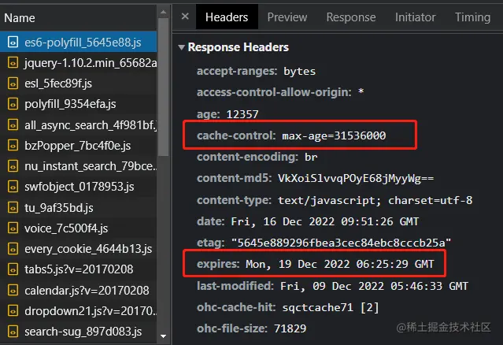
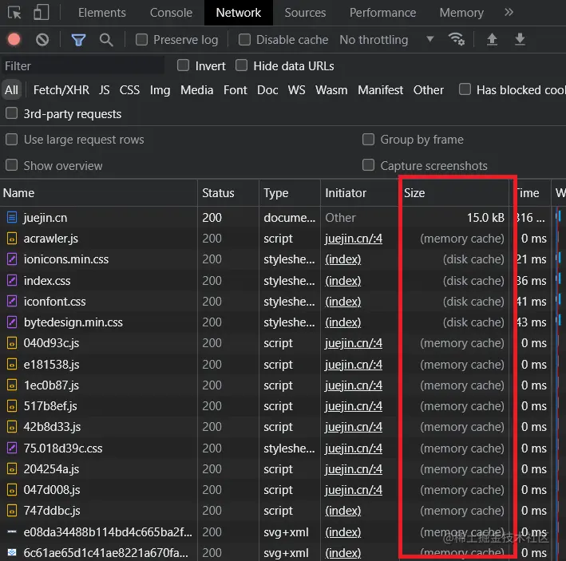
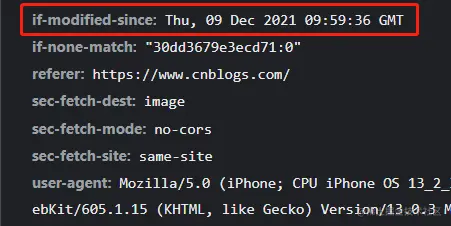
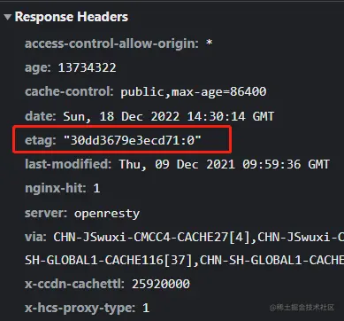
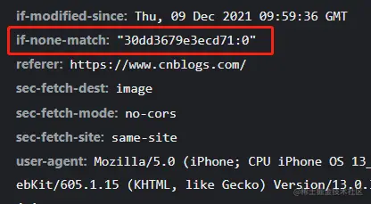
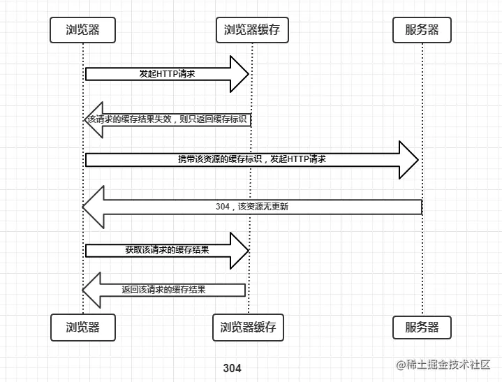
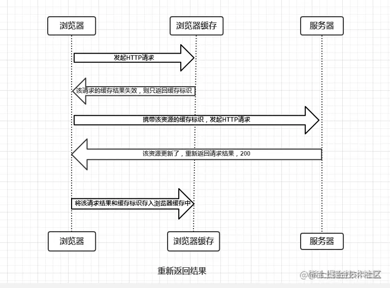
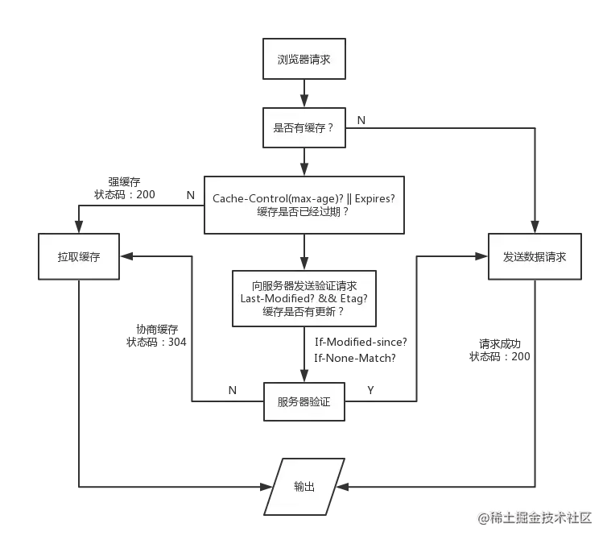

# 浏览器缓存机制

## 强缓存
强缓存 是指浏览器在缓存资源时，按照服务器返回的缓存控制头部 ` Cache-Control`  或 ` Expires` 来决定是否可以直接从缓存中读取资源，而无需向服务器发起请求。若缓存有效，则浏览器直接使用缓存的数据，不会向服务器发送请求，极大提高页面加载速度。强缓存的核心在于 
**有效期** 的控制。
### Cache-Control

是 HTTP1.1 中控制网页缓存的字段，主要取值为：
* public：资源客户端和服务器都可以缓存
* privite：资源只有客户端可以缓存
* no-cache：客户端缓存资源，但是是否缓存需要经过协商缓存来验证
* no-store：不使用缓存
* max-age：缓存保质期，是相对时间

上图中，HTTP 响应头中 Cache-Control 为 max-age = 31536000，意思是说在 31536000 秒后该资源过期，如果未超过过期时间，浏览器会直接使用缓存结果，强制缓存生效 
Cache-Control: no-cache 和 no-store的区别： 
Cache-Control: no-cache：这个很容易让人产生误解，误以为是响应不被缓存 
实际上Cache-Control: no-cache 是会被缓存的，是协商缓存的标识，只不过每次都会向服务器发起请求，来验证当前缓存的有效性 
Cache-Control: no-store：这个才是响应不被缓存的意思 

### Expires
是HTTP1.0控制网页缓存的字段，值为一个时间戳，服务器返回该资源缓存的到期时间 
但 Expires 有个缺点，**就是它判断是否过期是用本地时间来判断的，本地时间是可以自己修改的** 
到了HTTP/1.1，Expire 已经被 Cache-Control 替代，Cache-Control 使用了max-age相对时间，解决了Expires 的缺陷 
**注意：当 Cache-Control 与 expires 两者都存在时，Cache-Control 优先级更高** 

### 强缓存类型(memory cache 和 disk cache)

两者都属于强缓存，主要区别在于存储位置和读取速度上
* memory cache 表示缓存来自内存， disk cache 表示缓存来自硬盘
* memory cache 要比 disk cache 快的多！从磁盘访问可能需要5-20毫秒，而内存访问只需要100纳秒甚至更快
* memory cache 特点：
当前tab页关闭后，数据将不存在（资源被释放掉了），再次打开相同的页面时，原来的 memory cache 会变成 disk cache
* disk cache 特点：
关闭tab页甚至关闭浏览器后，数据依然存在，下次打开仍然会是 from disk cache。
第一次打开任意网页并刷新：缓存来自 memory cache 和 disk cache
闭页面再打开时：所有的缓存都来自 disk cache

## 协商缓存
协商缓存 是指浏览器通过**向服务器发送请求**，询问资源是否发生了变化，从而决定是否使用缓存的机制。与 **强缓存** 不同，**协商缓存**并不直接依赖于固定的缓存过期时间，而是通过与服务器的通信来判断资源是否更新。协商缓存是一种 **条件请求**，通过 HTTP 头部 来实现。

### Last-Modified 响应
Last-Modified 指文件在服务器最后被修改的时间

Last-Modified 的验证流程：
* 第一次访问页面时，服务器的响应头会返回 Last-Modified 字段
* 客户端再次发起该请求时，请求头 If-Modified-Since 字段会携带上次请求返回的 Last-Modified 值
* 服务器根据 if-modified-since 的值，与该资源在服务器最后被修改时间做对比，若服务器上的时间大于 Last-Modified 的值，则重新返回资源，返回200，表示资源已更新；反之则返回304，代表资源未更新，可继续使用缓存

### ETag 响应
当前资源文件的一个唯一标识(由服务器生成)，若文件内容发生变化该值就会改变，一旦 ETag 变化代表缓存失效。

**ETag 的验证流程：**
* 第一次访问页面时，服务器的响应头会返回 etag 字段
* 客户端再次发起该请求时，请求头 If-None-Match 字段会携带上次请求返回的 etag 值
* 服务器根据 If-None-Match 的值，与该资源在服务器的Etag值做对比，若值发生变化，状态码为200，表示资源已更新；反之则返回304，代表资源无更新，可继续使用缓存。

**为什么要有 Etag ？**： Etag 的出现主要是为了解决一些 Last-Modified 难处理的问题。
* 一些文件也许会周期性的更改，但是内容并不改变(仅仅改变的修改时间)，这时候并不希望客户端认为这个文件被修改了而重新去请求；
* 某些文件修改非常频繁，比如在秒以下的时间内进行修改，(比方说 1s 内修改了 N 次)，If-Modified-Since 能检查到的粒度是秒级的，使用 Etag 就能够保证这种需求下客户端在 1 秒内能刷新 N 次 cache。

**注意：Etag 优先级高于 Last-Modified，若 Etag 与 Last-Modified 两者同时存在，服务器优先校验 Etag**

## **现代浏览器的默认缓存机制**

强缓存与协商缓存相结合的方案
* HTML 文档配置协商缓存；
* JS、CSS、图片等资源配置强缓存

此方案的好处：当项目版本更新时，可以获取最新的页面；若版本未变化，可继续复用之前的缓存资源；既很好利用了浏览器缓存，又解决了页面版本更新的问题